# YesChill AI Code

> 零代码 AI 应用生成平台 — 用自然语言描述你想要的网站，AI 自动生成完整代码并一键部署。

## 功能特性

- **自然语言生成应用** — 输入描述即可生成 HTML页面、多文件静态站或完整的 Vue 3 + Vite 工程
- **双模式生成** — 快速模式逐 token 流式输出，工作流模式带图片素材收集 + 代码质量检查
- **AI 智能路由** — 根据需求复杂度自动选择 HTML / 多文件 / Vue 项目的生成策略
- **SSE 流式输出** — 实时流式展示 AI 生成过程，所见即所得
- **实时预览** — 生成完成后在 iframe 中即时预览网站效果
- **可视化元素编辑** — 编辑模式下可点选页面元素，精准修改指定内容
- **一键部署** — 生成的代码可直接部署到云端，自动生成截图封面
- **代码下载** — 支持将生成的项目打包下载为 ZIP 文件
- **AI 工作流** — 基于 LangGraph4j 的多步骤流水线：图片采集 → 提示增强 → 路由 → 代码生成 → 质量检查 → 项目构建
- **用户系统** — 注册登录、个人中心、头像上传
- **管理后台** — 应用管理、用户管理、对话记录管理

## 系统截图

### 首页与创建

| 首页（已登录） | 工作流模式创建 |
|---|---|
| 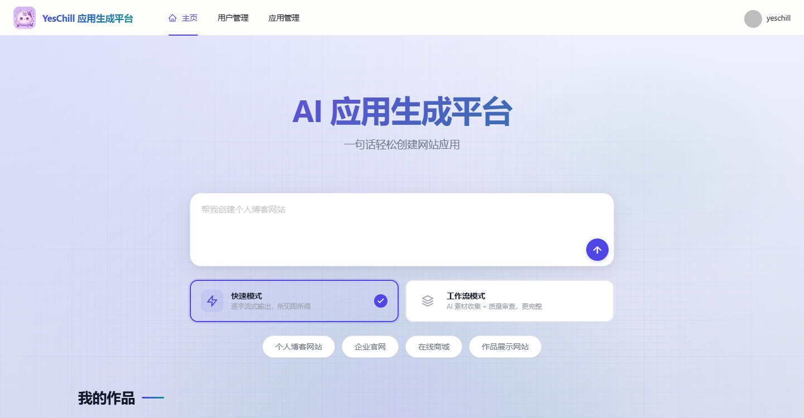 | 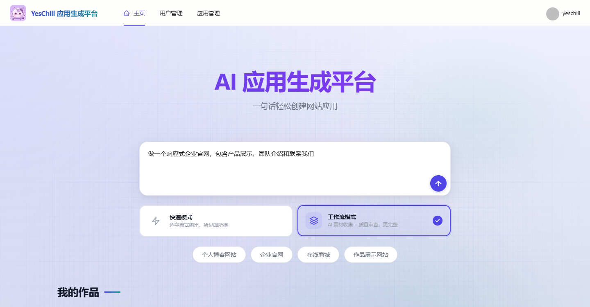 |

| 我的应用 + 精选 | 登录页面 |
|---|---|
| 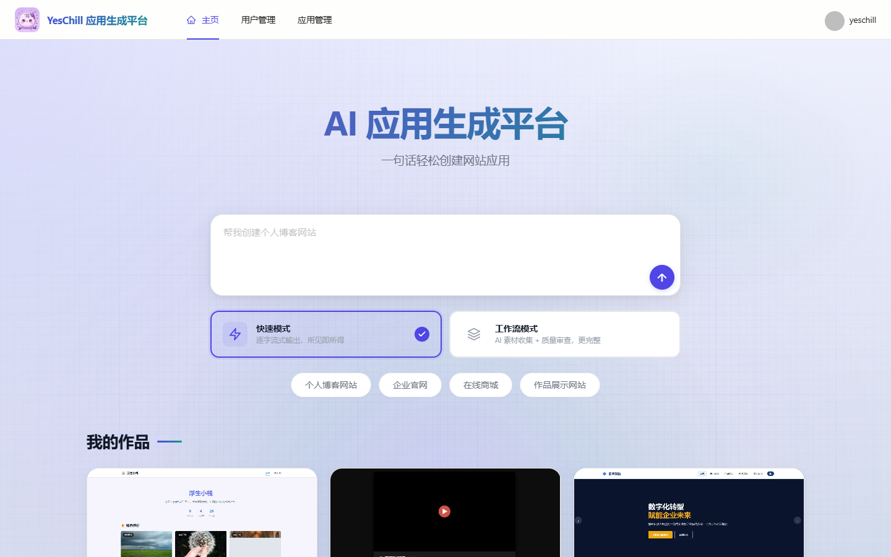 | 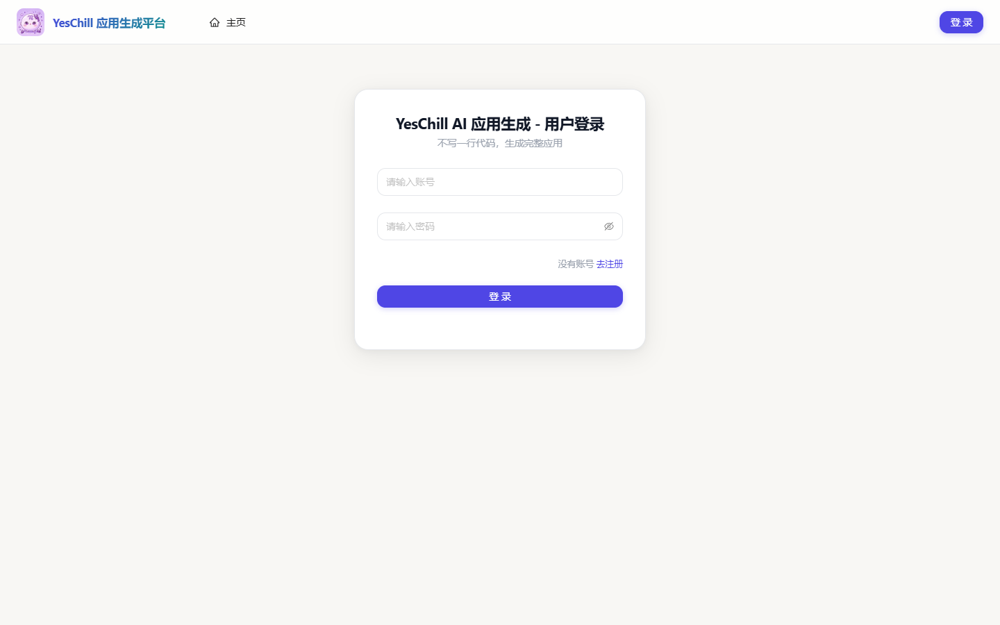 |

| 注册页面 | 个人中心 |
|---|---|
| 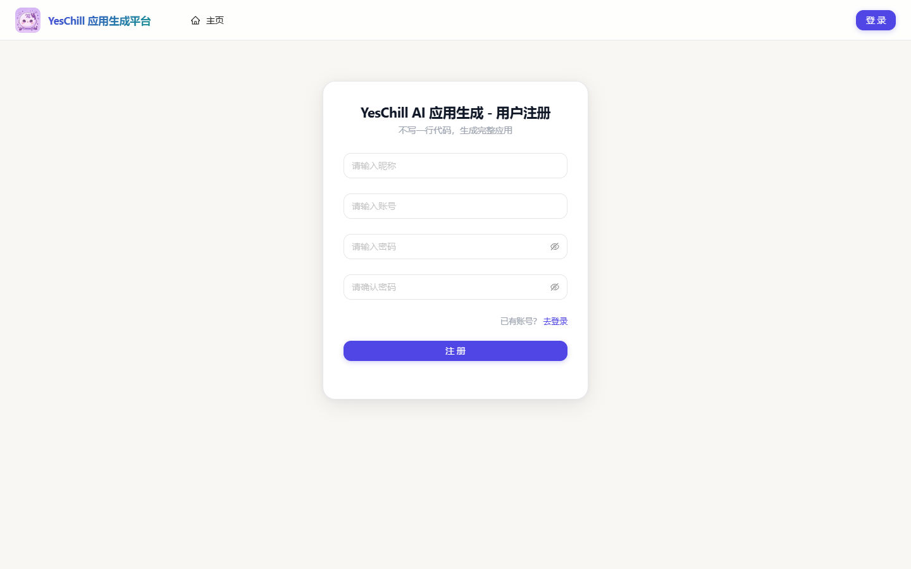 | 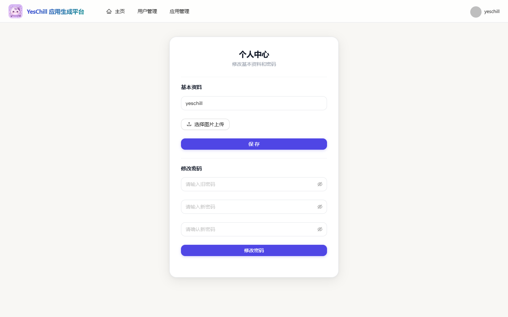 |

### 应用与对话

| 聊天页面 | API 文档 |
|---|---|
| 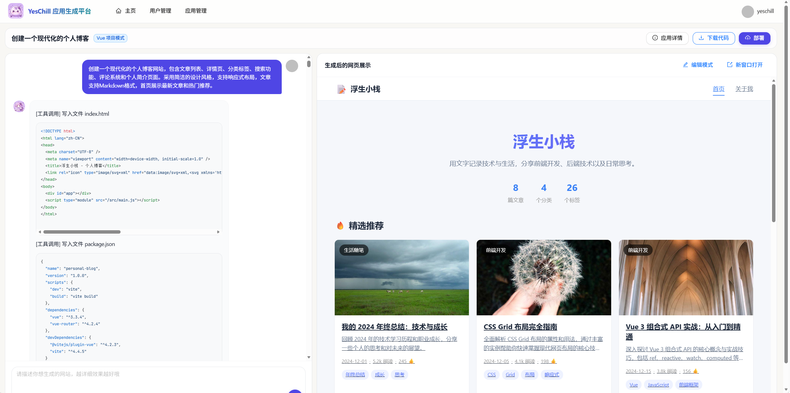 | 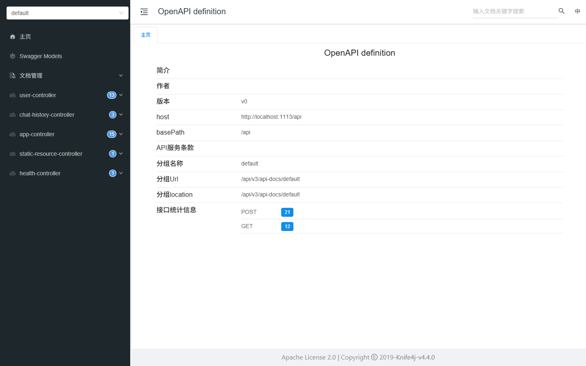 |

### 管理后台

| 应用管理 | 用户管理 |
|---|---|
| 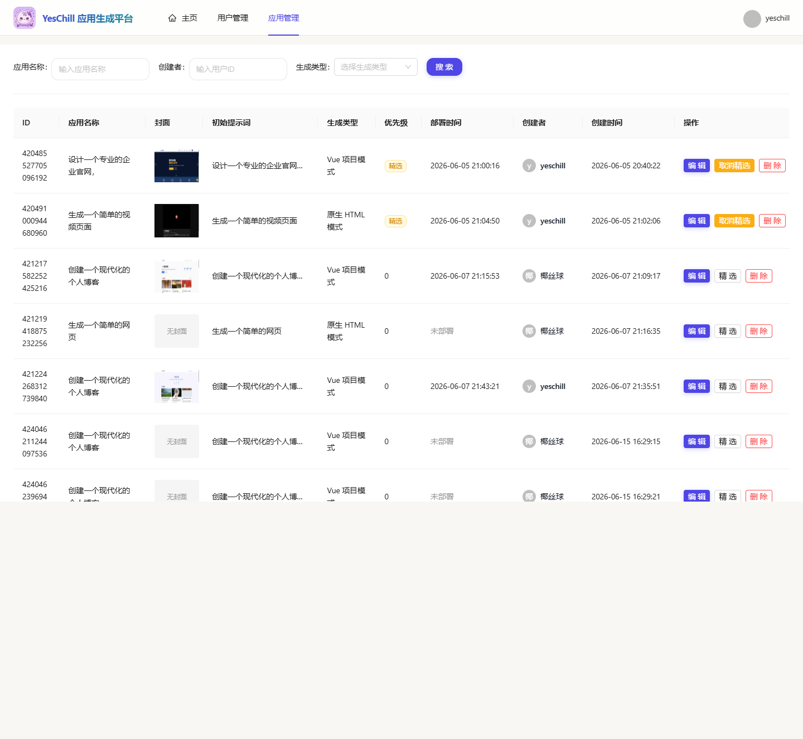 | 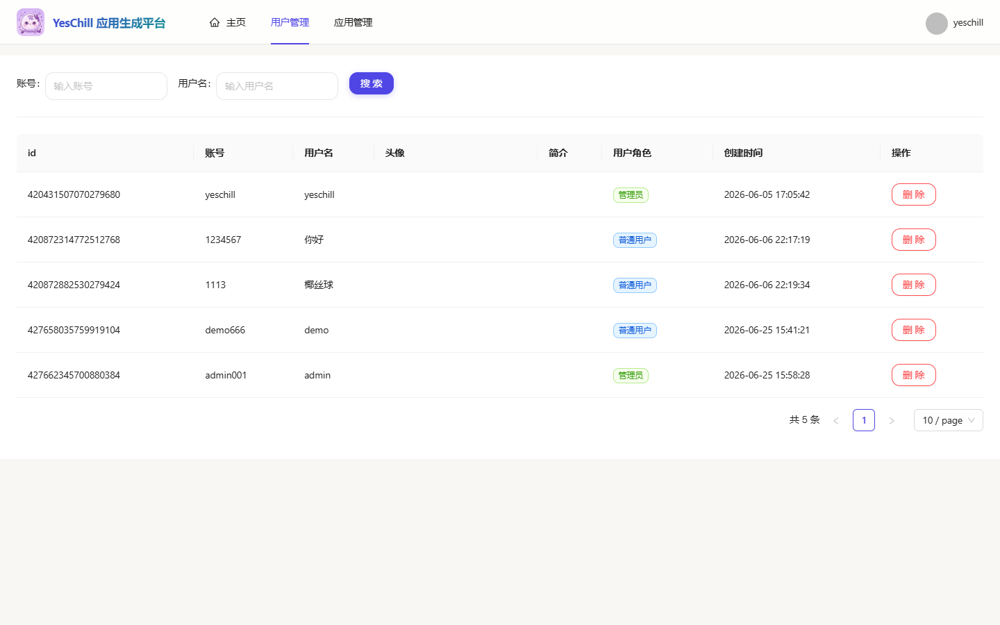 |

| 对话管理 |
|---|
| 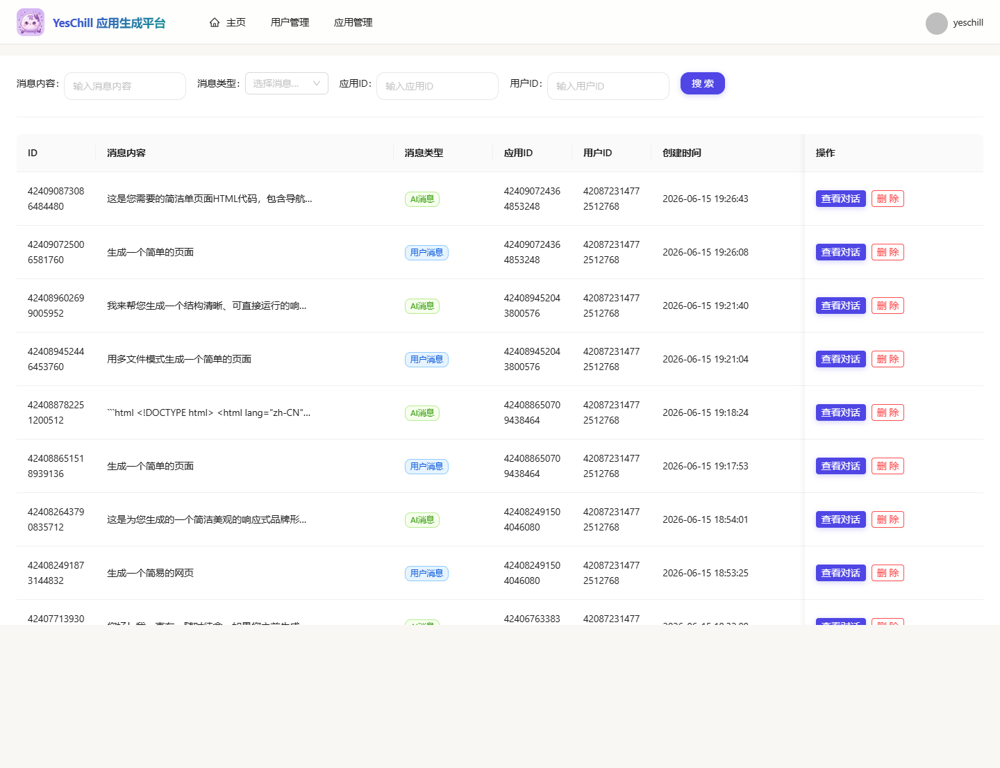 |

## 技术栈

### 后端

| 技术 | 版本 | 说明 |
|------|------|------|
| Java | 21 | 虚拟线程、模式匹配、Switch 表达式 |
| Spring Boot | 3.5.4 | 核心框架，响应式 SSE 流式传输 |
| MyBatis-Flex | 1.11.1 | ORM 框架，支持游标分页与雪花 ID |
| MySQL | 8.0 | 关系型数据库 |
| Redis | 6.0+ | Spring Session 会话管理 + 缓存 |
| Redisson | 3.50.0 | 分布式限流 |
| LangChain4j | 1.1.0 | AI 服务声明式编程，结构化输出与工具调用 |
| LangGraph4j | 1.6.0-rc2 | 图状态机编排多步骤 AI 工作流 |
| DeepSeek API | — | 双模型：deepseek-v4-flash + deepseek-v4-pro |
| 腾讯云 COS | 5.6.227 | 对象存储（头像、截图、Mermaid 图表） |
| DashScope | 2.21.1 | 阿里云通义万相 AI 图片生成 (wan2.2-t2i-flash) |
| Selenium | 4.33.0 | 部署后自动网页截图生成封面 |
| Knife4j | 4.4.0 | 基于 Swagger 的 API 文档 |

### 前端

| 技术 | 版本 | 说明 |
|------|------|------|
| Vue 3 | 3.5.x | Composition API + TypeScript |
| TypeScript | 5.8 | 类型安全 |
| Vite | 7.x | 构建工具，HMR 热更新 |
| Ant Design Vue | 4.2.x | 企业级 UI 组件库 |
| Pinia | 3.x | 状态管理 |
| Vue Router | 4.5.x | 路由管理 |
| Axios | 1.11 | HTTP 客户端 |
| markdown-it + highlight.js | 14.x | Markdown 渲染与代码语法高亮 |
| @umijs/openapi | — | 自动从后端 OpenAPI 规范生成 TypeScript API 代码 |

## 项目结构

```
yeschill-ai-code/
├── yeschill-ai-code/                    # 后端 (Spring Boot 3.5)
│   ├── pom.xml                          # Maven 配置，Spring Boot 依赖管理
│   ├── sql/
│   │   ├── init.sql                     # 新建数据库初始化脚本
│   │   └── upgrade.sql                  # 已有数据库增量升级脚本
│   ├── src/main/java/com/yeschillaicode/
│   │   ├── controller/                  # REST API 接口层
│   │   │   └── AppController.java       # 应用管理 + AI 代码生成 SSE 端点
│   │   ├── service/                     # 业务逻辑层
│   │   │   ├── AppService.java          # 应用服务接口
│   │   │   ├── ChatHistoryService.java  # 对话历史服务
│   │   │   └── impl/                    # 实现类
│   │   ├── core/                        # 核心代码生成引擎
│   │   │   ├── AiCodeGeneratorFacade.java  # AI 生成门面：流式生成 + 文件保存
│   │   │   ├── handler/                 # 流式处理器（文本/JSON/TokenStream）
│   │   │   └── bulider/                 # Vue 项目 npm 构建器
│   │   ├── ai/                          # LangChain4j AI 服务声明
│   │   │   ├── AiCodeGeneratorService.java           # 代码生成 AI 服务
│   │   │   ├── AiCodeGenTypeRoutingService.java      # 代码类型智能路由
│   │   │   ├── AiCodeGeneratorServiceFactory.java    # AI 服务实例工厂 (Caffeine 缓存)
│   │   │   ├── tool/                    # AI 文件操作工具 (read/write/modify/delete/dir)
│   │   │   └── guardrail/              # 安全护栏 (PromptSafetyInputGuardrail + RetryOutputGuardrail)
│   │   ├── langgraph4j/                 # AI 工作流模块
│   │   │   ├── CodeGenWorkflow.java     # 工作流编排：全流程6节点 / 简化4节点
│   │   │   ├── node/                    # 工作流节点实现
│   │   │   ├── state/WorkflowContext.java # 工作流状态上下文
│   │   │   ├── model/                   # 工作流数据模型
│   │   │   ├── tools/                   # 工作流工具 (图片搜索/Logo生成/Mermaid图表/插画)
│   │   │   └── ai/                      # 工作流 AI 服务 (图片规划/质量检查)
│   │   ├── config/                      # Spring 配置类
│   │   ├── aspect/                      # AOP 切面 (AuthInterceptor 鉴权)
│   │   ├── ratelimiter/                 # 基于 Redisson 的 @RateLimit 注解
│   │   ├── model/                       # 实体 / DTO / VO / 枚举
│   │   ├── mapper/                      # MyBatis-Flex Mapper
│   │   ├── manager/                     # CosManager 云存储管理
│   │   └── utils/                       # SpringContextUtil 等工具类
│   ├── src/main/resources/
│   │   ├── application.yml              # 主配置 (环境变量占位符)
│   │   ├── application-prod.yml         # 生产环境配置
│   │   └── prompt/                      # AI 系统提示词模板 (7个)
│   └── src/test/                        # 测试
│
├── yeschill-ai-code-frontend/    # 前端 (Vue 3 + Vite 7)
│   ├── nginx.conf                       # 生产环境 Nginx 配置
│   ├── openapi2ts.config.ts             # 后端 OpenAPI → 前端 API 代码生成
│   ├── .env.local                       # 本地环境变量
│   └── src/
│       ├── api/
│       │   ├── typings.d.ts             # 自动生成的 TypeScript 类型
│       │   ├── appController.ts         # 自动生成的应用 API 调用
│       │   ├── chatHistoryController.ts # 自动生成的对话历史 API
│       │   └── userController.ts        # 自动生成的用户 API
│       ├── pages/
│       │   ├── HomePage.vue             # 首页：创建应用 + 模式选择 + 精选列表
│       │   └── app/
│       │       └── AppChatPage.vue      # 聊天页：对话 + 实时预览 + 可视化编辑
│       ├── components/
│       │   ├── AppCard.vue              # 应用卡片
│       │   ├── MarkdownRenderer.vue     # Markdown 渲染器
│       │   ├── AppDetailModal.vue       # 应用详情弹窗
│       │   ├── DeploySuccessModal.vue   # 部署成功弹窗
│       │   └── GlobalHeader.vue         # 全局导航栏
│       ├── stores/                      # Pinia 状态管理
│       ├── router/                      # Vue Router 路由配置
│       └── utils/                       # 工具函数 + VisualEditor 可视化编辑
│
└── nginx-1.30.2/                        # Nginx Windows 运行环境
```

## 快速开始

### 环境要求

- **JDK** 21+
- **Node.js** 18+
- **MySQL** 8.0+
- **Redis** 6.0+
- **Maven** 3.8+ （或使用项目自带的 `mvnw`）
- **mmdc** （可选，Mermaid 图表转 SVG）

### 1. 初始化数据库

新建数据库：

```bash
mysql -u root -p < yeschill-ai-code/sql/init.sql
```

已有数据库升级：

```bash
mysql -u root -p yeschill_ai_code < yeschill-ai-code/sql/upgrade.sql
```

### 2. 配置环境变量

```bash
# 数据库
export DB_HOST=localhost
export DB_PORT=3306
export DB_USERNAME=root
export DB_PASSWORD=your_password
export DB_NAME=yeschill_ai_code

# Redis
export REDIS_HOST=localhost
export REDIS_PORT=6379

# AI 模型
export AI_BASE_URL=https://api.deepseek.com
export AI_API_KEY=your_deepseek_api_key

# 对象存储 (腾讯云 COS，可选)
export COS_HOST=your-cos-host
export COS_REGION=ap-guangzhou
export COS_BUCKET=your-bucket

# DashScope 图片生成 (可选)
export DASHSCOPE_API_KEY=your_dashscope_key

# 图片素材 (可选)
export PIXABAY_API_KEY=your_pixabay_key
```

### 3. 启动后端

```bash
cd yeschill-ai-code

# 编译并启动
./mvnw spring-boot:run
```

后端启动后访问：
- API 文档：http://localhost:1113/api/doc.html
- 健康检查：http://localhost:1113/api/health

### 4. 启动前端

```bash
cd yeschill-ai-code-frontend

npm install
npm run dev
```

前端开发服务器启动后访问：http://localhost:5173

### 5. 使用流程

1. 打开首页，输入应用描述（如"做一个电商首页"）
2. 选择生成模式：**快速模式**（逐 token 流式）/ **工作流模式**（带图片素材 + 质量检查）
3. 点击发送 → AI 自动生成代码 → 右侧实时预览
4. 不满意可继续对话修改，或开启编辑模式精准调整页面元素
5. 满意后一键**部署**到云端，或**下载 ZIP** 离线部署

## 配置参考

### 完整环境变量

| 环境变量 | 说明 | 默认值 |
|----------|------|--------|
| `DB_HOST` | MySQL 主机地址 | localhost |
| `DB_PORT` | MySQL 端口 | 3306 |
| `DB_NAME` | 数据库名 | yeschill_ai_code |
| `DB_USERNAME` | MySQL 用户名 | root |
| `DB_PASSWORD` | MySQL 密码 | — |
| `REDIS_HOST` | Redis 主机地址 | localhost |
| `REDIS_PORT` | Redis 端口 | 6379 |
| `REDIS_PASSWORD` | Redis 密码 | — |
| `SERVER_PORT` | 后端端口 | 1113 |
| `AI_BASE_URL` | DeepSeek API 地址 | https://api.deepseek.com |
| `AI_API_KEY` | DeepSeek API Key | — |
| `AI_MODEL_NAME` | 快速模型 | deepseek-v4-flash |
| `AI_REASONING_MODEL` | 推理模型（Vue项目） | deepseek-v4-pro |
| `COS_HOST` | 腾讯云 COS 域名 | — |
| `COS_REGION` | COS 区域 | ap-guangzhou |
| `COS_BUCKET` | COS 存储桶名称 | — |
| `COS_SECRET_ID` | COS SecretId | — |
| `COS_SECRET_KEY` | COS SecretKey | — |
| `DASHSCOPE_API_KEY` | 通义万相 API Key | — |
| `PIXABAY_API_KEY` | Pixabay 图片搜索 Key | — |
| `CODE_DEPLOY_HOST` | 部署域名 | http://localhost |

### 前端环境变量（`.env.local`）

```bash
VITE_API_BASE_URL=http://localhost:1113/api
VITE_DEPLOY_DOMAIN=http://localhost
```

## 代码生成模式

| 模式 | 生成方式 | AI 模型 | 适用场景 |
|------|---------|---------|----------|
| **快速模式** | 逐 token SSE 流式输出 | deepseek-v4-flash | 日常微调，快速迭代 |
| **工作流模式** | 步骤级 SSE 事件（图片收集→增强→路由→生成→质检→构建） | deepseek-v4-flash + deepseek-v4-pro | 首次生成，追求完整度和图片质量 |

代码类型由 AI 智能路由自动判断：

| 生成类型 | 产物 | 说明 |
|---------|------|------|
| HTML | 单文件 HTML（内联 CSS/JS） | 简单页面、快速原型 |
| MULTI_FILE | 多文件静态站（HTML/CSS/JS 分离） | 中等复杂度静态站 |
| VUE_PROJECT | 完整 Vue 3 + Vite 工程 | 复杂应用，支持 SPA 路由 |

## AI 工作流

工作流模式下基于 LangGraph4j 编排的多步骤流水线：

**首次生成（全流程 6 节点）：**

```
用户输入
  ↓
图片采集 — Pixabay 内容图 + Undraw 插画 + Mermaid 架构图 + AI 生成 Logo
  ↓
提示增强 — 将图片资源描述注入原始提示词
  ↓
AI 路由 — 分析需求复杂度，选择 HTML / MULTI_FILE / VUE_PROJECT
  ↓
代码生成 — 调用 DeepSeek 生成完整代码并写入磁盘
  ↓
质量检查 — AI 代码审查，检查语法/结构/完整性
  ├── 通过 → 项目构建（Vue）或跳过（HTML/多文件）
  └── 失败 → 带修复建议重新进入代码生成
  ↓
完成
```

**后续修改（简化流程 4 节点）：**

```
用户修改指令
  ↓
代码生成 → 质量检查 → 项目构建
              ↻ 失败重试
```

## 生产部署

### Nginx 配置

项目提供 [nginx.conf](yeschill-ai-code-frontend/nginx.conf)，主要配置：

- 前端静态文件服务（`/usr/share/nginx/html`）
- API 反向代理到后端 `http://127.0.0.1:1113`，支持 SSE 长连接
- 部署应用的静态资源服务（`/dist/` 路径）

部署时需要配置 `proxy_buffering off` 和 `proxy_read_timeout 600s` 以支持 SSE 流式传输。

### 部署步骤

```bash
# 1. 构建前端
cd yeschill-ai-code-frontend
npm run build  # 产出 dist/ 目录

# 2. 将 dist/ 上传到服务器 Nginx 静态目录

# 3. 后端打包
cd yeschill-ai-code
./mvnw clean package -DskipTests

# 4. 运行
java -jar target/yeschill-ai-code-0.0.1-SNAPSHOT.jar
```

## 架构说明

```
浏览器
  ├── 首页 (/)               — 创建应用、模式选择
  ├── 聊天页 (/app/chat/:id)  — 发送消息、查看预览、部署
  └── 登录页 (/user/login)    — 用户认证

前端 (Vue 3 + Vite) ──HTTP/SSE──→ Nginx ──反向代理──→ Spring Boot (Java 21)
                                                           │
                              ┌────────────────────────────┼────────────────────────┐
                              │                            │                        │
                         LangChain4j                 LangGraph4j               MyBatis-Flex
                     (AI 服务声明式编程)          (工作流图状态机)            (ORM + 游标分页)
                              │                            │                        │
                         DeepSeek API              工作流节点链               MySQL + Redis
```

### 关键设计

- **AI 服务工厂模式**：通过 Caffeine 缓存 AI 服务实例（写入 30 分钟 / 访问 10 分钟过期），避免每次请求重建
- **SSE 流式平滑发送**：快速模式缓冲所有 chunk 后以 5ms 间隔逐条回放；工作流模式完成全部节点后回放收集的流式数据
- **工作流双图模式**：首次生成走完整 6 节点（含图片采集），后续修改走简化 4 节点（仅生成+质检+构建），根据聊天历史记录数自动切换
- **虚拟线程异步**：工作流执行、截图生成、部署构建均使用 Java 21 虚拟线程，不阻塞请求线程
- **@RateLimit 限流**：基于 Redisson 的注解式分布式限流，AI 对话端点为每用户每分钟 5 次

---

## 工作流模块详解

### 节点职责

| 节点 | 类 | 说明 |
|------|-----|------|
| 图片采集 | `ImageCollectorNode` | AI 分析需求 → 生成采集计划 → 并发调用 Pixabay / Undraw / Mermaid / DashScope 收集素材 |
| 提示词增强 | `PromptEnhancerNode` | 将收集到的图片 URL 和描述注入原始提示词，指导 AI 在代码中嵌入素材 |
| 智能路由 | `RouterNode` | 调用 AI 判断最佳代码生成类型（HTML / MULTI_FILE / VUE_PROJECT） |
| 代码生成 | `CodeGeneratorNode` | 调用 `AiCodeGeneratorFacade` 流式生成代码并保存，同时收集所有 chunk 用于完成后回放 |
| 质量检查 | `CodeQualityCheckNode` | 读取生成的文件内容，调用 AI 审查代码质量，返回问题列表和修复建议 |
| 项目构建 | `ProjectBuilderNode` | 对 VUE_PROJECT 执行 `npm install && npm run build`，产出 dist 目录 |

### 路由逻辑

```
code_quality_check 完成后:
  ├── 质检失败 → 回到 code_generator（带错误信息和修复建议重试）
  ├── 质检通过 + VUE_PROJECT → project_builder（npm 构建）
  └── 质检通过 + HTML/MULTI_FILE → END（跳过构建）
```

### 首次 vs 后续

`AppServiceImpl.chatToGenCodeWithWorkflow()` 通过 `chatHistoryService.countByAppId()` 判断：

- **count == 0** → 全流程（6 节点），含图片采集和路由
- **count > 0** → 简化流程（4 节点），跳过采集和路由，直接生成

---

## API 接口

### 应用

| 方法 | 路径 | 说明 |
|------|------|------|
| GET | `/app/chat/gen/code` | 快速模式 SSE 流式生成（逐 token） |
| GET | `/app/chat/gen/code/workflow` | 工作流模式 SSE 生成（步骤进度 + 代码回放） |
| POST | `/app/add` | 创建应用 |
| POST | `/app/deploy` | 部署应用到云端 |
| GET | `/app/deploy/status` | 查询部署状态（QUEUED/BUILDING/DONE/FAILED） |
| GET | `/app/download/{appId}` | 下载应用代码 ZIP |
| POST | `/app/my/list/page/vo` | 分页查询我的应用 |
| POST | `/app/good/list/page/vo` | 分页查询精选应用 |

### SSE 事件格式

**快速模式** (`/app/chat/gen/code`):

```
data: {"d":"<chunk_text>"}          // 逐 token
event: done                          // 完成
event: business-error                // 业务错误
```

**工作流模式** (`/app/chat/gen/code/workflow`):

```
event: workflow_start                // {"totalSteps":6, "steps":["图片收集",...]}
event: step_start                    // {"stepNumber":1, "currentStep":"图片收集"}
event: step_completed                // {"stepNumber":1, "currentStep":"图片收集"}
...
data: {"d":"<code_chunk>"}           // 所有节点完成后回放代码片段
event: codegen_done                  // 代码回放完成
event: workflow_completed            // 工作流结束
event: workflow_error                // 工作流异常
```

### 用户

| 方法 | 路径 | 说明 |
|------|------|------|
| POST | `/user/register` | 注册 |
| POST | `/user/login` | 登录 |
| GET | `/user/get/login` | 获取当前登录用户信息 |

### 对话历史

| 方法 | 路径 | 说明 |
|------|------|------|
| GET | `/chatHistory/app/{appId}` | 分页查询应用对话历史（游标分页） |
| POST | `/chatHistory/admin/*` | 管理员对话记录管理 |

---

## 常见问题

### Q: 快速模式和工作流模式怎么选？

**快速模式**适合日常微调——"把这个按钮改成红色"、"标题加粗"，逐字流式输出，速度快。
**工作流模式**适合首次生成或大改——"做一个电商首页"，会先收集图片素材、增强提示词、生成后 AI 自动检查代码质量，出来的成品更完整。

### Q: 工作流模式为什么看不到逐字输出？

工作流模式的代码生成节点内部仍然走流式 API，但所有 chunk 被收集起来，等全部节点执行完毕后以 5ms 间隔统一回放。这样做既能保持工作流的完整性（图片→增强→路由→生成→质检→构建），又保留逐字"打字"的视觉体验。

### Q: 代码质量检查失败会怎样？

质检失败时工作流自动回到代码生成节点，把错误列表和修复建议附在提示词里让 AI 重新生成，循环直到通过或超时。

### Q: Vue 项目部署为什么需要排队？

Vue 项目需要 `npm install && npm run build`，耗时长（1-3 分钟）。后端用定时任务（每 5 秒）串行消费构建队列，避免并发构建撑爆服务器。构建状态可通过 `/app/deploy/status` 查询。

### Q: 生成的代码存在哪里？

代码保存在 `{CODE_OUTPUT_ROOT_DIR}/{codeGenType}_{appId}/` 目录，部署时复制到 `{CODE_DEPLOY_ROOT_DIR}/{deployKey}/`。部署后的 URL 格式为 `{CODE_DEPLOY_HOST}/{deployKey}/`。

### Q: 怎么添加新的 AI 模型？

1. 在 `application.yml` 中添加新的 ChatModel Bean 配置
2. 修改 `AiCodeGeneratorServiceFactory` 引用新模型
3. 如需不同场景用不同模型，在 Factory 的 switch 分支里指定

---

## 开发指南

### 添加新的工作流节点

1. 在 `langgraph4j/node/` 下创建节点类，实现 `AsyncNodeAction<MessagesState<String>> create()` 静态方法
2. 从 `WorkflowContext` 读取输入，处理后将结果写回 context
3. 在 `CodeGenWorkflow.createFullWorkflow()` 或 `createSimplifiedWorkflow()` 中注册节点和边
4. 更新 `stepNames` 列表
5. 前端 `workflowSteps` 会自动读取并显示

### 修改 AI 提示词

提示词模板位于 `src/main/resources/prompt/` 目录：

| 文件 | 用途 |
|------|------|
| `codegen-html-system-prompt.txt` | HTML 生成 |
| `codegen-multi-file-system-prompt.txt` | 多文件生成 |
| `codegen-vue-project-system-prompt.txt` | Vue 项目生成 |
| `codegen-routing-system-prompt.txt` | 代码类型路由 |
| `code-quality-check-system-prompt.txt` | 代码质量检查 |
| `image-collection-plan-system-prompt.txt` | 图片采集计划 |
| `image-collection-system-prompt.txt` | 图片采集工具调用 |

提示词通过 LangChain4j 的 `@SystemMessage(fromResource = "prompt/...")` 注入，修改后无需重新编译 Java 代码。

### 数据库迁移

新增字段使用 `sql/upgrade.sql` 添加幂等 DDL：

```sql
ALTER TABLE `app` ADD COLUMN `你的字段` VARCHAR(255) DEFAULT NULL COMMENT '说明';
```

同时更新 `sql/init.sql` 和 `src/sql/create_table.sql`。

---

## License

MIT
